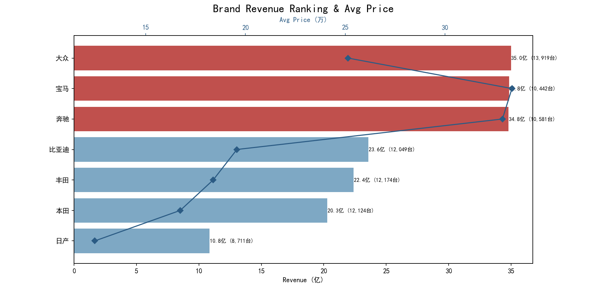
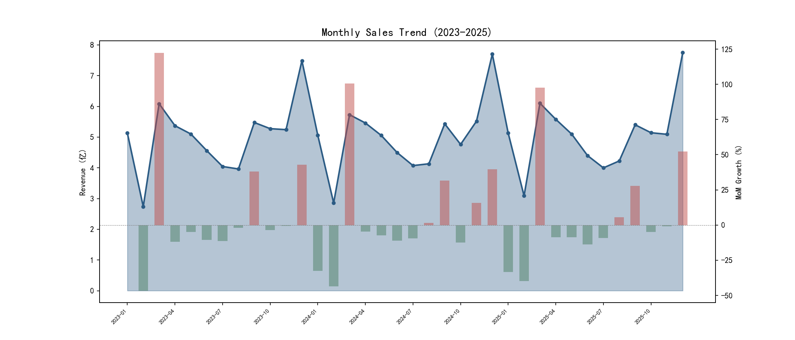
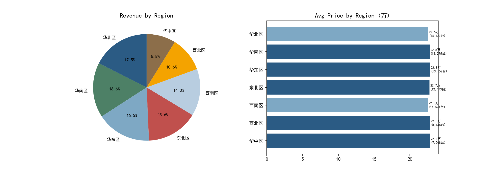
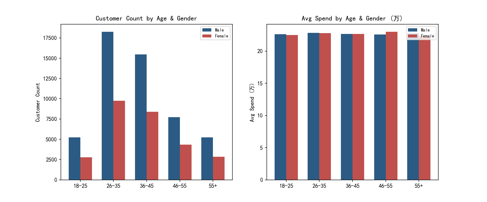
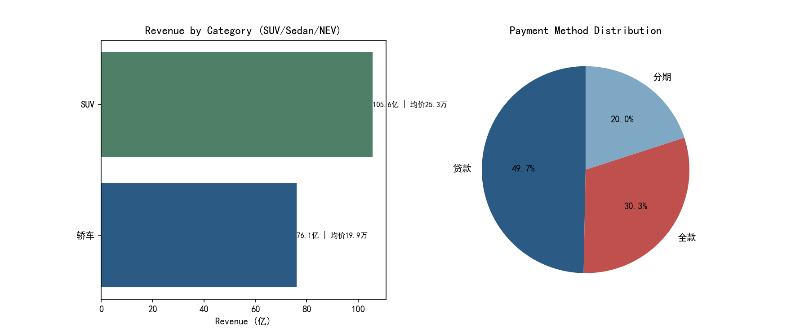
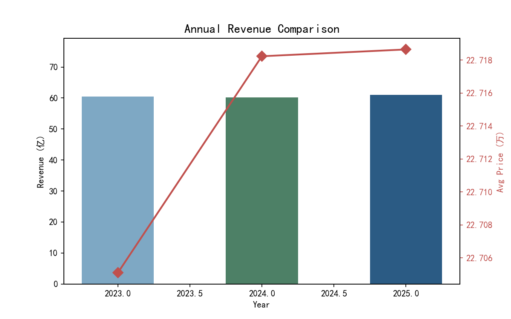

# 汽车销售复盘分析

以某汽车经销商 3 年 8 万条销售记录为对象的经营复盘分析。围绕"卖什么、什么时候卖、卖给谁、怎么卖"四个业务问题，用 SQL 完成数据提取与指标计算，用 Python 完成可视化呈现，最终汇总为一份 Excel BI 看板。

## 分析框架

| 业务问题 | 分析维度 | 方法 |
|---|---|---|
| 卖什么 | 品牌 / 车型 / 品类结构 | 销售额排行、均价对比、SUV vs 轿车 vs 新能源 |
| 什么时候卖 | 时间趋势 | 月度走势、环比、年度同比、季节性 |
| 卖给谁 | 客户画像 | 年龄段 × 性别交叉、客单价分布 |
| 怎么卖 | 销售方式 | 全款 / 贷款 / 分期结构、折扣率、贷款渗透率 |
| 谁来卖 | 团队效能 | 区域对比、销售人员业绩排名 |

## 核心结论

- **品牌格局**：大众以 35.0 亿元销售额居首（1.39 万台，走量路线）；宝马、奔驰销量不及大众，但凭借 32 万元以上的均价跻身前三，呈现"量"与"价"两条截然不同的营收路径
- **品类结构**：SUV 是绝对主力，销售额 105.6 亿元（均价 25.3 万），约为轿车（76.1 亿、均价 19.9 万）的 1.4 倍
- **季节规律**：销量呈明显的"年末冲高、春节回落"周期——每年 12 月前后冲量（2024 年末单月近 7.7 亿元），2 月春节跌入谷底，环比波动最高超过 ±50%
- **客户画像**：26–35 岁为第一大购车人群（约 2.8 万人），男性客户数量全面高于女性；但各年龄段客单价几乎持平（约 21–22 万），说明消费力差异主要体现在"买不买"而非"买多贵"
- **支付方式**：贷款购车占比 49.7% 已近半数，全款仅 30.3%，金融渗透率高，是影响成交的重要杠杆

## 成果展示

| 品牌营收排名 | 月度趋势 |
|---|---|
|  |  |

| 区域分析 | 客户画像 |
|---|---|
|  |  |

| 品类与支付 | 年度对比 |
|---|---|
|  |  |

完整的交互式汇总见 `output/汽车销售BI分析看板.xlsx`（含 KPI 指标卡与联动图表）。

## 数据集

| 表 | 规模 | 说明 |
|---|---|---|
| `cars` | 46 款车型 | 7 大品牌，覆盖轿车 / SUV / 新能源，含指导价 |
| `salespersons` | 103 人 | 按区域、城市分布 |
| `sales` | 80,000 条 | 2023–2025 年销售记录，含成交金额、客户性别 / 年龄段、支付方式、折扣率、是否贷款 |

## 文件说明

| 文件 | 说明 |
|---|---|
| `analysis.sql` | 全部业务指标的 SQL 实现（MySQL，建表 + 20 组分析查询） |
| `visualize.py` | 6 张分析图表的生成代码（Pandas + Matplotlib） |
| `excel_dashboard.py` | Excel BI 看板生成代码（openpyxl 原生图表） |
| `generate_data.py` | 脱敏模拟数据的生成代码（固定种子，可复现） |
| `data/` | 三张数据表 |
| `output/` | 分析图表与 Excel 看板成品 |

## 工具

SQL（MySQL）· Python（Pandas / Matplotlib / openpyxl）· Excel

## License

MIT
