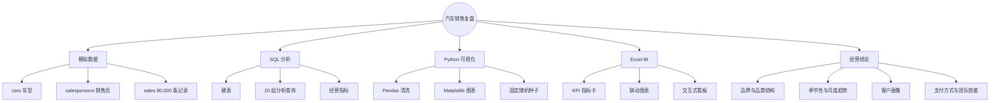
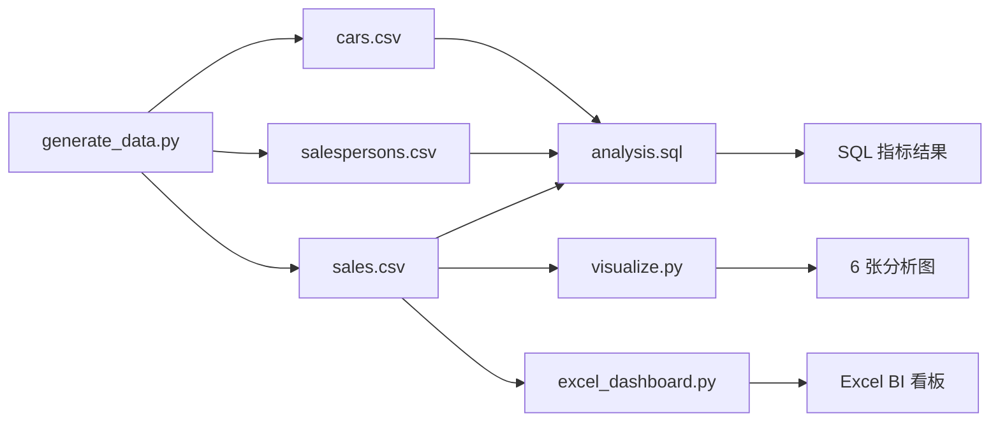
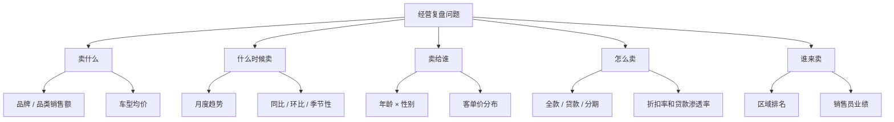
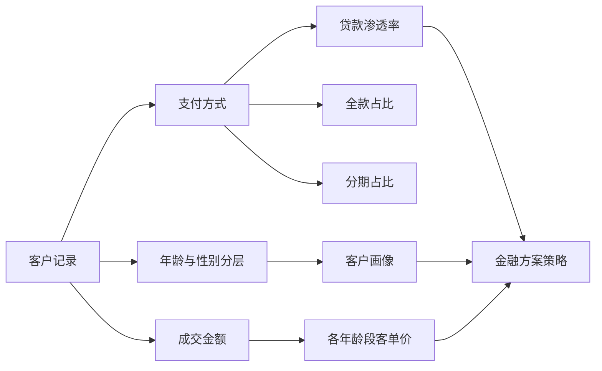
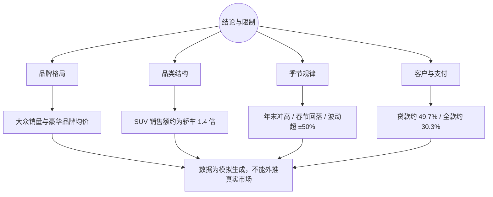

# 项目可视化与可解释性指南

本页用思维导图、流程、指标树、结论地图和现有图表解释汽车销售复盘项目。需要注意的是，本项目数据由 `generate_data.py` 按固定随机种子生成，数字用于演示方法，不代表真实企业。

## 图 1：项目能力思维导图

## 图 2：数据生成与分析流程

数据、图表和 Excel 都可以从生成脚本重新构建，当前仓库不包含真实汽车经销商数据。

## 图 3：分析问题与指标树

## 图 4：支付方式与客户结构解释

## 图 5：结论、证据与限制地图

## 既有分析图表

### 品牌营收

解释：比较不同品牌的销售额、销量和价格带，识别走量与高价值路线。

### 月度趋势

解释：观察季节性、年末冲量和春节回落等时间规律。

### 客户画像

解释：展示年龄、性别和客单价结构，用于解释不同客户群体的购车行为。

### 品类与支付

解释：结合品类、支付方式和折扣信息，分析产品结构与金融渗透率。

## 视觉阅读顺序

1. 图 1 看项目模块和模拟数据边界。
2. 图 2 看数据生成到 SQL、图表和 Excel 的完整链路。
3. 图 3 看五个经营问题和对应指标。
4. 图 4 看客户、支付和金融策略之间的解释关系。
5. 图 5 与四张图表用于说明结论、证据和不可外推的限制。